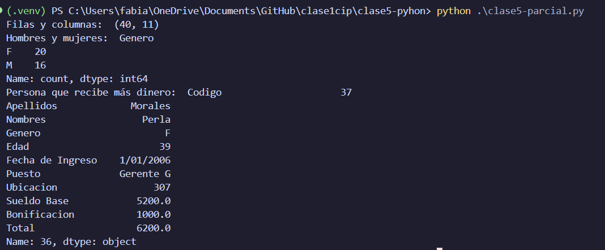
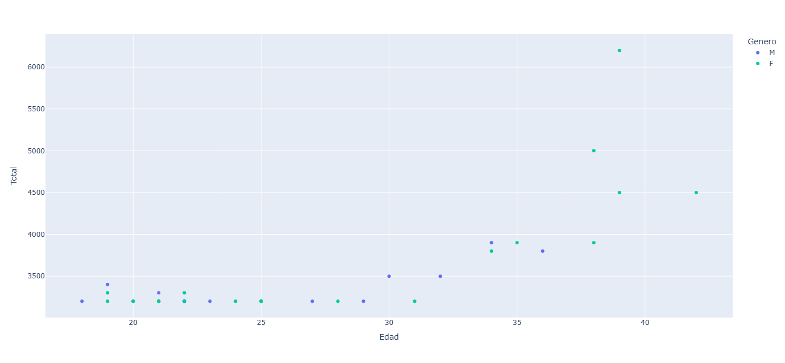

Lee el dataframe y realiza los siguientes ejercicios:
- Indica el numero de filas y columnas 
- Cambia el nombre de las columnas 
- ¿Cuantos hombres y mujeres hay? 
- ¿Quíen es la persona que recibe más dinero? 
- Realiza una de las gráficas posibles al usar Matplotlib o Plotly y  escribe un parrafo interpretando los resultados.  


```python
import pandas as pd

df = pd.read_csv("datos.csv")

print("Filas y columnas: ", df.shape)

df.columns = ['Codigo', 'Apellidos', 'Nombres', 'Genero', 'Edad', 'Fecha de Ingreso', 'Puesto', 'Ubicacion', 'Sueldo Base', 'Bonificacion', 'Total']

print("Hombres y mujeres: ", df['Genero'].value_counts())

print("Persona que recibe más dinero: ", df.loc[df['Total'].idxmax()])

import plotly.express as px
fig = px.scatter(df, x='Edad', y='Total', color='Genero')

fig.show()
```

## Resultados:

### Ejecución del código:



### Gráfica generada y analisis:

En la gráfica se puede observar que las mujeres tienen un sueldo base mayor que los hombres, sin embargo, los hombres tienen una bonificación mayor que las mujeres.


