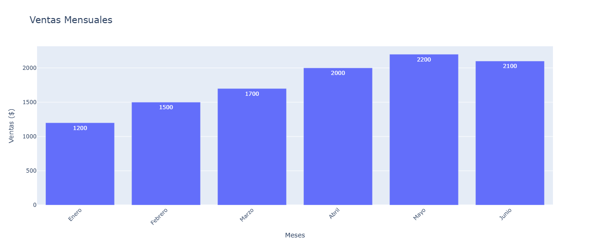

Para trabajar con Plotly y Pandas, primero necesitas tener instaladas las librerías correspondientes. Si no las tienes, puedes instalarlas con el siguiente comando (si no lo hiciste en el papartado de instalación de esta guia):

```bash
pip install plotly pandas
```

Una vez que tengas las librerías instaladas, puedes importarlas en tu script de Python con los siguientes comandos:

```python
import pandas as pd
import plotly.express as px

# Crear un DataFrame con datos de ejemplo
data = {
    "Mes": ["Enero", "Febrero", "Marzo", "Abril", "Mayo", "Junio"],
    "Ventas": [1200, 1500, 1700, 2000, 2200, 2100]
}

df = pd.DataFrame(data)

# Crear un gráfico interactivo con Plotly Express
fig = px.bar(
    df, 
    x="Mes", 
    y="Ventas", 
    title="Ventas Mensuales",
    labels={"Mes": "Mes", "Ventas": "Cantidad Vendida ($)"},  # Etiquetas
    text="Ventas"  # Mostrar valores en las barras
)

# Mejorar el diseño del gráfico
fig.update_layout(
    xaxis_title="Meses",
    yaxis_title="Ventas ($)",
    title_font_size=20,
    xaxis_tickangle=-45  # Inclinar las etiquetas del eje X
)

# Mostrar el gráfico
fig.show()
```	
El resultado es el siguiente:

