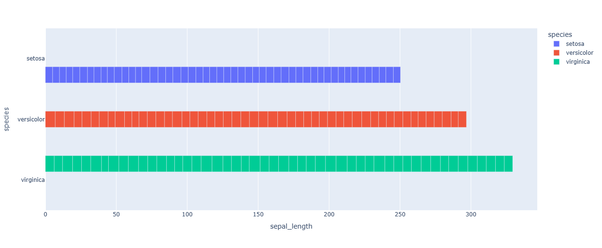

Compara diferentes categorías.

```python
import plotly.express as px

# Importamos px para datos ficticios
df = px.data.iris()

# Creamos el grafico
fig = px.bar(df, x="sepal_length", y="species", color="species", barmode='group')

# Lo imprimimos
fig.show()
```
El resultado es el siguiente:

