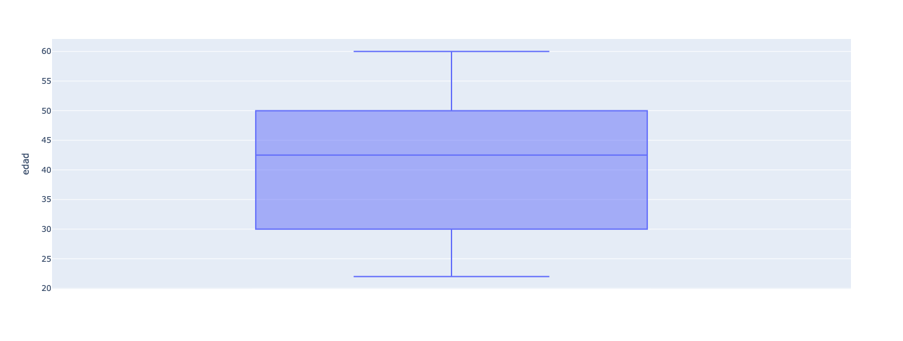
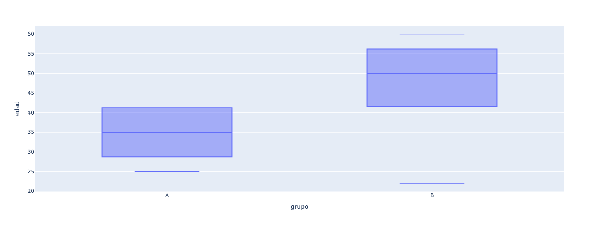

Ejemplo de grafico de cajas simple.

-Visualización de una sola variable: Este tipo de diagrama te muestra la distribución de una única variable numérica, como la edad en nuestro ejemplo.

-Elementos clave: La caja, la línea de la mediana y los bigotes te ofrecen una visión rápida de los cuartiles, la mediana y los valores extremos de los datos.

-Ideal para: Entender la dispersión de los datos, identificar valores atípicos y evaluar la simetría de la distribución.

```python
import plotly.express as px

# Crear un DataFrame con datos de ejemplo
import pandas as pd
df = pd.DataFrame({'edad': [25, 30, 35, 40, 45, 50, 22, 60, 55, 48]})

# Crear el diagrama de cajas
fig = px.box(df, y="edad")

# Mostrar el gráfico
fig.show()
```
El resultado es el siguiente:



Ejemplo de grafico de cajas multiples.


-Comparación de múltiples grupos: Cuando tienes datos categorizados (por ejemplo, grupos A y B), puedes crear diagramas de cajas para comparar la distribución de una variable numérica entre esos grupos.

-Visualización de diferencias: Al colocar los diagramas de cajas uno al lado del otro, puedes identificar fácilmente si existe una diferencia significativa en la distribución de los datos entre los grupos.

-Ideal para: Analizar si hay diferencias significativas entre grupos, identificar grupos atípicos y comparar la variabilidad entre grupos.

```python
# Crear un DataFrame con datos de dos grupos
df = pd.DataFrame({'edad': [25, 30, 35, 40, 45, 50, 22, 60, 55, 48],
                   'grupo': ['A', 'A', 'A', 'A', 'A', 'B', 'B', 'B', 'B', 'B']})

# Crear el diagrama de cajas
fig = px.box(df, x="grupo", y="edad")
fig.show()
```

El resultado es el siguiente:


