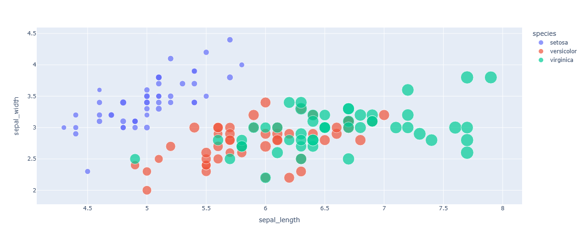

Visualizan relaciones entre dos variables.
Muestra la relación entre dos variables continuas utilizando puntos. Se utiliza para identificar correlaciones o patrones en los datos.
Variantes: Se puede agregar una dimensión extra con colores o tamaños de los puntos.
```python
import plotly.express as px

# Datos aleatorios
df = px.data.iris()

# Creamos el gráfico
fig = px.scatter(df, x="sepal_length", y="sepal_width", color="species", size="petal_length")

# Mostramos el gráfico
fig.show()
```
El resultado es el siguiente:

