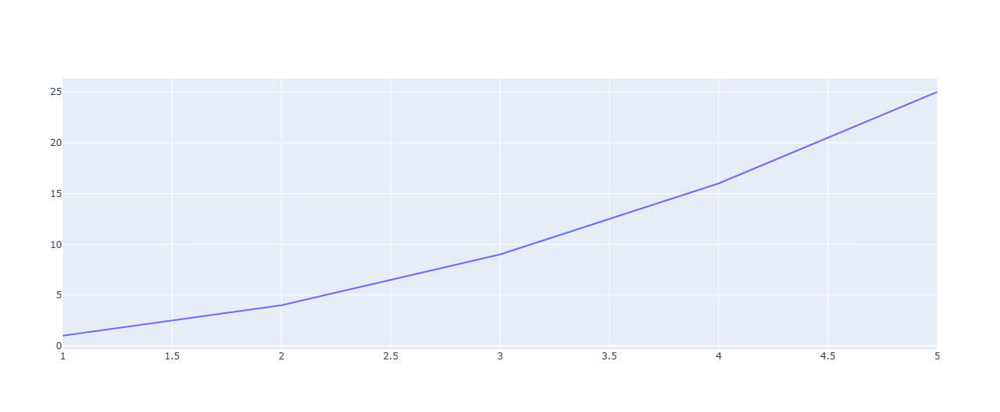

Muestran tendencias a lo largo del tiempo o de una variable.
Se utiliza para mostrar tendencias o cambios en los datos a lo largo del tiempo o en relación con una variable continua.

```python
import plotly.graph_objects as go

# Datos aleatorios
x = [1, 2, 3, 4, 5]
y = [1, 4, 9, 16, 25]

# Creamos el gráfico
fig = go.Figure(data=go.Scatter(x=x, y=y, mode='lines'))

# Mostramos el gráfico
fig.show()
```
El resultado es el siguiente:

