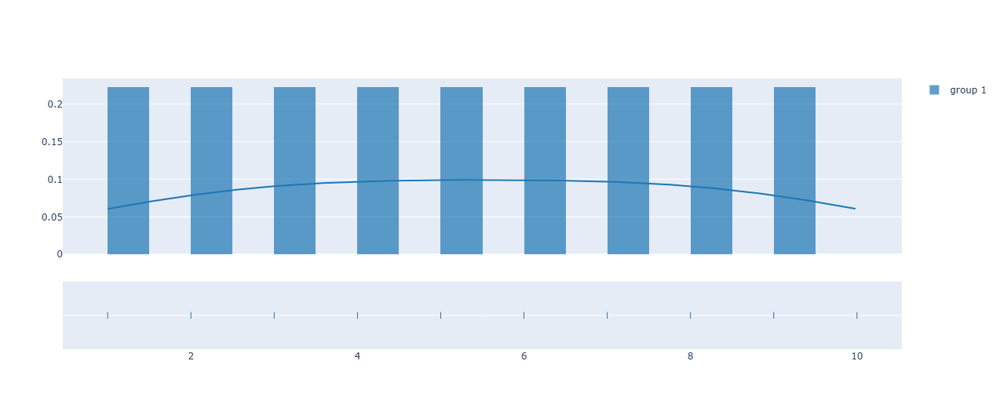

Ideales para mostrar proporciones.

```python	
import plotly.figure_factory as ff

# Datos aleatorios
x = [1, 2, 3, 4, 5, 6, 7, 8, 9, 10]

# Creamos el gráfico
fig = ff.create_distplot([x], ['group 1'], bin_size=0.5)

# Mostramos el gráfico
fig.show()
```
El resultado es el siguiente:

