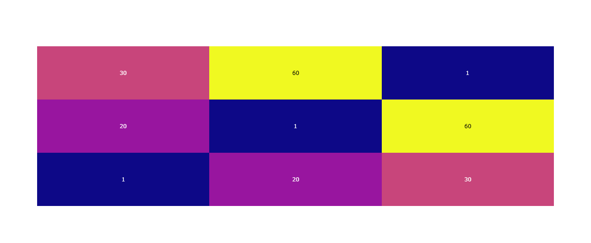

Muestran valores en una matriz.
Representa valores en una matriz como colores. Es útil para mostrar relaciones o patrones en grandes cantidades de datos.
Aplicaciones: Se usa en análisis de correlaciones, patrones de datos, y datos categóricos con frecuencia.

```python
import plotly.figure_factory as ff

# Datos aleatorios
z = [[1, 20, 30],
     [20, 1, 60],
     [30, 60, 1]]

# Creamos el gráfico
fig = ff.create_annotated_heatmap(z=z)

# Mostramos el gráfico
fig.show()
```
El resultado es el siguiente:

